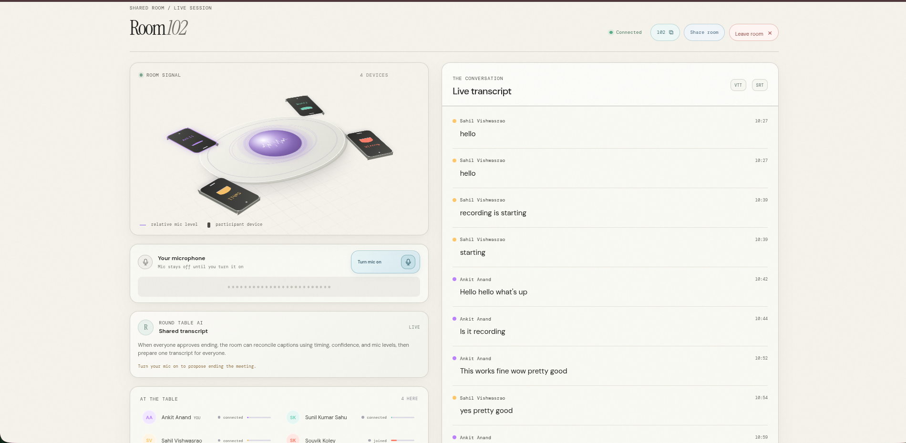

# Roundtable

Roundtable is a phone-first shared room for live, speaker-attributed captions and AI-powered meeting summaries. Built for fast, collaborative, and accessible conversations, it seamlessly tracks who is speaking and transcribes the room in real-time.

**For Judges - Live Demo Link:**  
🔗 **[Roundtable on Vercel](https://bnb-26-shadow-knights-internal-roun.vercel.app/)**



---

## ✨ Features

- **Live Speaker Attribution:** Visualizes real-time audio levels to show exactly who is speaking using dynamic, colorful waveforms.
- **Collaborative Captions:** Uses the Web Speech API (with PCM fallback) to deliver fast, low-latency live captions to everyone in the room.
- **Democratic Meeting Controls:** Built-in voting mechanism. Any active speaker can propose to end the meeting, requiring unanimous consent to conclude.
- **Gemini AI Summaries:** Once a meeting concludes, the backend securely processes the finalized transcripts and broadcasts a structured, markdown-formatted AI summary directly back to everyone's screen.
- **Responsive "Phone View":** Test the mobile experience seamlessly from a desktop browser using the universal navigation toggle.

---

## 🏗 Architecture

- **Frontend:** Next.js (React) application. It handles microphone capture, audio processing worklets (20ms level/VAD), WebSocket communication, and responsive UI rendering.
- **Backend:** Python + FastAPI + WebSockets (`speech_lineup.py`). Maintains room state, syncs participant presence, handles the voting lifecycle, reconciles caption segments, and integrates with the Google Gemini API for post-meeting summarization.

---

## 🚀 Deployment

### Frontend (Vercel)
The root Next.js app is deployed to Vercel. Set the `NEXT_PUBLIC_API_URL` environment variable to point to your backend's HTTP origin. 

*If no `NEXT_PUBLIC_API_URL` is set, the frontend will start in a visual Preview Mode with sample participants and captions.*

### Backend (Render)
The backend is configured for 1-click deployment on Render using the included `render.yaml` Blueprint.

1. Create a new **Blueprint** on your Render dashboard and point it to this repository.
2. The blueprint will automatically provision a **Free Web Service** instance.
3. Add the following environment variable to the service:
   - `GEMINI_API_KEY`: Your Google Gemini API key (required for AI summaries).
4. **Keep-alive:** The frontend automatically pings the backend every 10 minutes to prevent the Render free tier from sleeping during active sessions.

---

## 💻 Local Development

### 1. Start the Backend
The backend runs on Python and uses WebSockets.
```bash
python -m pip install -r requirements.txt
export GEMINI_API_KEY="your-api-key-here"
python speech_lineup.py
```
*(The backend will start on `http://localhost:8000`)*

### 2. Start the Frontend
```bash
npm install
npm run dev
```
Open `http://localhost:3000`. The frontend will automatically connect to `http://localhost:8000` on localhost.

> **Note:** For microphone access on physical phones in local development, you must serve the frontend over HTTPS (e.g., using a tool like `ngrok` or a trusted development tunnel).

---

## 📁 Project Structure

- `src/app/` — Production UI, CSS, and routing.
- `src/lib/audio/` — Shared microphone capture, Web Speech integration, WebSocket buffering, and calibration client.
- `public/worklet/level-processor.js` — Custom 20ms audio level/VAD worklet.
- `speech_lineup.py` — The core Python WebSocket server and Gemini AI integration.
- `render.yaml` — Infrastructure as Code (IaC) configuration for Render deployment.
